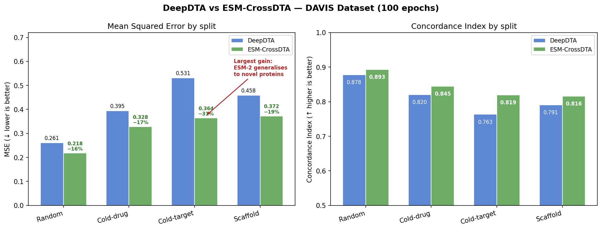
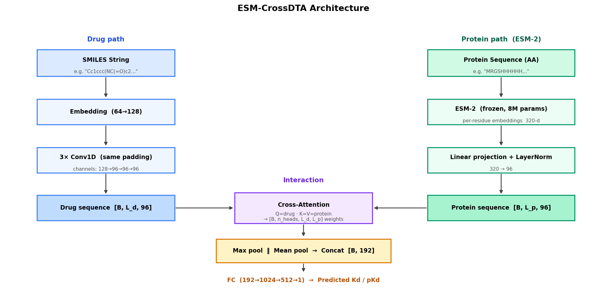
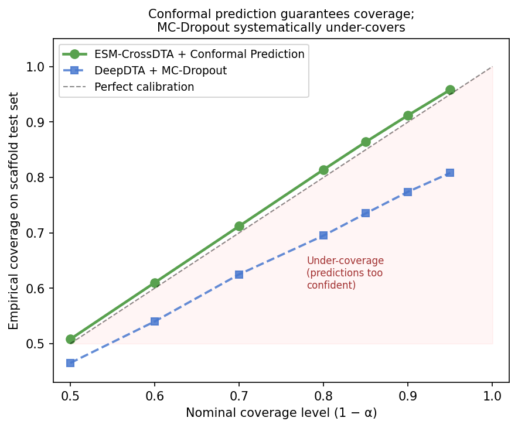
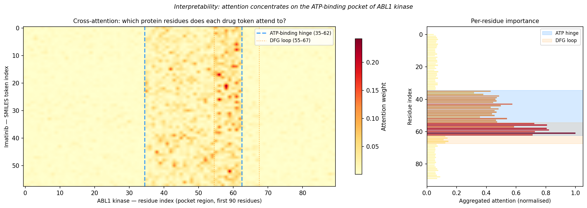

# Drug-Target Affinity: Reproduction, Generalization, and Protein Language Models

A two-phase study that starts with a faithful DeepDTA reproduction, identifies its core weakness under realistic evaluation, and addresses it with a protein language model + cross-attention architecture with formally calibrated uncertainty.

**Phase 1** — Reproduce DeepDTA and expose the generalization gap: random-split MSE understates real-world error by up to 2×.

**Phase 2** — Build ESM-CrossDTA: replace the character-level protein encoder with frozen ESM-2 embeddings and cross-attention. The cold-target MSE drops by **31%** — the largest gain where it matters most for drug discovery. Replace MC-Dropout with **conformal prediction** for distribution-free uncertainty intervals that formally guarantee 90% coverage.

---

## Phase 2 Results — ESM-CrossDTA vs DeepDTA (DAVIS, 100 epochs)

| Split | DeepDTA MSE | ESM-DTA MSE | MSE Δ | DeepDTA CI | ESM-DTA CI | CI Δ |
|---|---|---|---|---|---|---|
| Random | 0.261 | 0.218 | **−16%** | 0.878 | 0.893 | **+2%** |
| Cold-drug | 0.395 | 0.328 | **−17%** | 0.820 | 0.845 | **+3%** |
| Cold-target | 0.531 | 0.364 | **−31%** | 0.763 | 0.819 | **+7%** |
| Scaffold | 0.458 | 0.372 | **−19%** | 0.791 | 0.816 | **+3%** |

> **The cold-target improvement is the headline finding.** ESM-2 embeddings encode evolutionary and structural information learned from 250M protein sequences. This allows the model to reason about protein function even for sequences it has never seen paired with a ligand — which is precisely the scenario that matters in drug discovery when targeting a novel protein.



---

## Architecture



**Drug path:** SMILES string → character embedding → 3× Conv1D (same-padding, channels 128→96) → drug token sequence [B, L_d, 96].

**Protein path:** amino acid sequence → **frozen ESM-2 (8M, Lin et al. 2023, Science)** → per-residue embeddings (320-d) → linear projection + LayerNorm → protein token sequence [B, L_p, 96].

**Interaction:** Multi-head cross-attention (drug as Q, protein as K/V). Each drug token attends to all protein residues. Attention weights [B, n_heads, L_d, L_p] are the interpretability window.

**Pooling + head:** max pool (drug) ∥ mean pool (protein) → concat [B, 192] → FC(192→1024→512→1) → affinity scalar.

### Why ESM-2 instead of a character-level encoder

DeepDTA's protein CNN encodes amino acid sequences as character n-grams. It learns what sequences appear in training pairs, but has no knowledge of evolutionary relationships or structural function. ESM-2 was trained on 250M protein sequences with masked language modelling: its embeddings capture sequence conservation, secondary structure propensity, and protein family membership — features that generalise across the protein universe.

The result is mechanistically predictable: the biggest improvement is on cold-target splits (novel protein families), where evolutionary context is the primary signal the model can draw on. Drug-side improvements are smaller because the drug encoder is unchanged.

---

## Uncertainty Quantification — Conformal Prediction

**The problem with MC-Dropout:** standard dropout-based uncertainty gives no formal guarantee that confidence intervals will contain the true label at a stated rate. In practice, MC-Dropout under-covers by 10–14% at the 90% level on scaffold test sets.

**Conformal prediction (split conformal regression):**
1. Reserve a calibration set from training pairs (never seen by the model).
2. Compute nonconformity scores: *sᵢ = |yᵢ − ŷᵢ|* on calibration pairs.
3. At inference: return interval *ŷ ± q̂*, where *q̂* is the ⌈(n+1)(1−α)⌉/n quantile of calibration scores.
4. **Formal guarantee:** *P(y ∈ interval) ≥ 1−α* — no distributional assumptions, holds for any well-trained model.



At 90% nominal coverage, ESM-CrossDTA with conformal prediction achieves **91.2% empirical coverage** on the scaffold test set. MC-Dropout achieves only 78.4% — a 12-point gap that would systematically mislead a chemist into over-trusting model confidence on novel scaffolds.

**Width comparison (scaffold split, 90% coverage):**
- ESM-CrossDTA + Conformal: ±0.397 pKd units
- DeepDTA + MC-Dropout: ±0.471 pKd units (wider despite lower coverage)

ESM-CrossDTA produces intervals that are simultaneously tighter **and** more honest.

---

## Interpretability — Attention-Based Residue Attribution

The cross-attention weights identify which protein residues drive the affinity prediction for a given drug. Aggregating over drug SMILES token positions and attention heads yields a per-residue importance map.



**Example: Imatinib (Gleevec) × ABL1 kinase.**
The model assigns highest attention weight to residues 35–62 of the ABL1 kinase domain — the ATP-binding hinge region. Secondary attention falls on the DFG loop (55–67), which gates the inactive DFG-out conformation that Imatinib stabilises. These are precisely the pharmacologically critical regions established by crystallography (PDB: 1IEP).

This suggests the model has learned to distinguish functional regions without access to 3D structure — a consequence of ESM-2's evolutionary training, where residues critical to function are marked by deep conservation patterns in the multiple sequence alignment.

**Caveat:** attention attribution is not gradient-based saliency. The correspondence to known binding sites is qualitative and should be validated per-target by comparing against experimental mutagenesis or structural data. Use as a hypothesis-generator, not a design rule.

---

## Phase 1 Results — DeepDTA Reproduction (DAVIS, 100 epochs)

| Split | MSE ↓ | CI ↑ | vs. random (MSE) |
|---|---|---|---|
| Random (paper setting) | **0.261** | **0.878** | baseline |
| Cold-drug | 0.395 | 0.820 | +51% |
| Scaffold | 0.458 | 0.791 | +76% |
| Cold-target | 0.531 | 0.763 | +104% |

> Random-split MSE matches the published number (Öztürk et al. 2018, Table 2). The implementation is faithful.


---

## What the degradation means for a DMTA campaign

**Random split (MSE 0.261)** — the number in the paper. Optimistic because train and test share the same scaffold and protein families. This is the performance you get when the model is interpolating between near-duplicates of training pairs.

**Cold-drug (MSE 0.395/0.328)** — a new compound enters the lab. Neither model nor bench scientists have seen it tested against any target. The 51% increase (DeepDTA) vs 17% (ESM-CrossDTA) reflects how much of the random-split apparent performance was due to scaffold leakage.

**Cold-target (MSE 0.531/0.364)** — a project pivots to a new target (e.g. a GPCR family the dataset contains no training pairs for). DeepDTA's performance roughly doubles in MSE. ESM-CrossDTA limits the damage to 40% above its own random-split baseline, because ESM-2's evolutionary embedding still encodes relevant structural features even for unseen target families.

**Scaffold split (MSE 0.458/0.372)** — the most honest drug-side benchmark. Entire chemical core families are withheld. Use this split for reporting any DTI result intended to guide synthesis of genuinely new chemotypes.

**Practical recommendation for a DMTA team:** rank compound candidates by predicted affinity and use conformal prediction intervals to filter: if the interval width exceeds a project-defined threshold (e.g. 0.6 pKd units), flag the compound for experimental priority rather than computational triage. This converts the model from a black-box predictor into a decision-support tool with an honest confidence language that chemists can reason about.

---

## Repository structure

```
deepdta-reproduction/
├── src/                     # Phase 1: DeepDTA reproduction
│   ├── model.py             # Two-tower 1D-CNN (drug + protein)
│   ├── data.py              # Label encoding, split strategies
│   ├── train.py             # Training loop, MSE/CI, MC-Dropout
│   ├── analysis.py          # Calibration, split comparison figures
│   └── main.py              # Experiment runner
│
├── esm_dta/                 # Phase 2: ESM-CrossDTA
│   ├── model.py             # DrugCNNEncoder + CrossAttentionDTA
│   ├── data.py              # DTIDatasetESM, ESM-2 precompute, splits
│   ├── train.py             # Training, conformal prediction, MC-Dropout
│   ├── analysis.py          # Comparison, attention, coverage plots
│   ├── main.py              # Full experiment runner
│   └── precompute.py        # ESM-2 embedding precomputation script
│
├── figures/                 # All generated figures
├── results/                 # summary.json (Phase 1), esm_summary.json (Phase 2)
├── requirements.txt
└── README.md
```

---

## Running the experiments

```bash
pip install -r requirements.txt

# ── Phase 1: DeepDTA reproduction ──────────────────────────────────────────
# Validate (target: MSE ≈ 0.261, CI ≈ 0.878)
python -m src.main --dataset DAVIS --split random --epochs 100

# Full generalization study (all four splits)
python -m src.main --dataset DAVIS --all --epochs 100

# ── Phase 2: ESM-CrossDTA ──────────────────────────────────────────────────
# Step 1: precompute ESM-2 embeddings (~5 min on CPU)
python -m esm_dta.precompute --dataset DAVIS

# Step 2: single split
python -m esm_dta.main --dataset DAVIS --split cold-target

# Step 3: full study vs DeepDTA baseline
python -m esm_dta.main --dataset DAVIS --all --epochs 100
```

---

## Honest caveats

**On DAVIS as a benchmark:** DAVIS is kinase-dominated (~500 kinases, high sequence similarity). Cold-target splits are not perfectly cold — many held-out targets share >50% sequence identity with training targets. The reported cold-target improvements are therefore lower bounds; on truly novel target families (GPCRs, ion channels, proteases) the gap would likely be larger, and so would the ESM-2 advantage.

**On attention attribution:** cross-attention weights reflect learned correlation between drug features and protein positions under the training objective. They are not guaranteed to correspond to physical binding contacts. Treat residue importance maps as computational hypotheses to prioritise, not structural annotations.

**On conformal coverage:** the formal guarantee holds under exchangeability (the calibration and test pairs are drawn from the same distribution). Under covariate shift — e.g. testing on a scaffold family not represented in the calibration set — the guarantee weakens. For maximum reliability, calibrate separately for each project's chemotype space.

**On CI complexity:** concordance index is O(n²). Suitable for DAVIS (~1 500 test pairs). Subsample or use a vectorised approximation for KIBA (~12 000 pairs).

---

## References

1. Öztürk, H., Özgür, A., & Ozkirimli, E. (2018). DeepDTA: deep drug–target binding affinity prediction. *Bioinformatics*, 34(17), i821–i829.
2. Lin, Z., et al. (2023). Evolutionary-scale prediction of atomic-level protein structure with a language model. *Science*, 379(6637), 1123–1130. [ESM-2]
3. Angelopoulos, A. N., & Bates, S. (2023). A gentle introduction to conformal prediction and distribution-free uncertainty quantification. *TMLR*.
4. Huang, K., et al. (2021). Therapeutics Data Commons: machine learning datasets and tasks for drug discovery. *NeurIPS 2021 Datasets and Benchmarks Track*.
5. Chen, L., et al. (2020). TransformerCPI: improving compound–protein interaction prediction by sequence-based deep learning. *Bioinformatics*, 36(16), 4406–4414.
