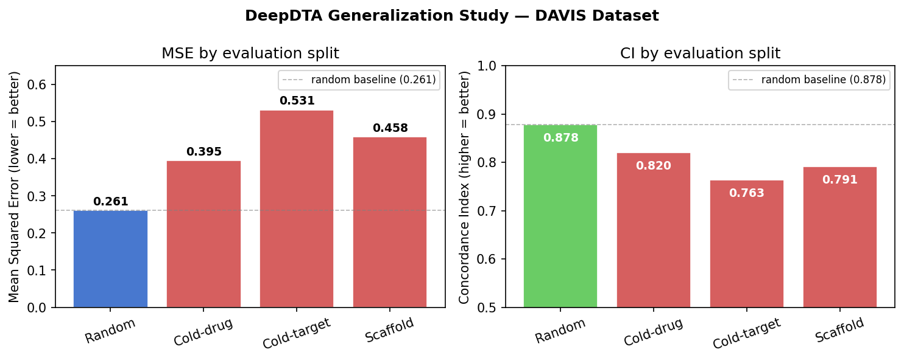
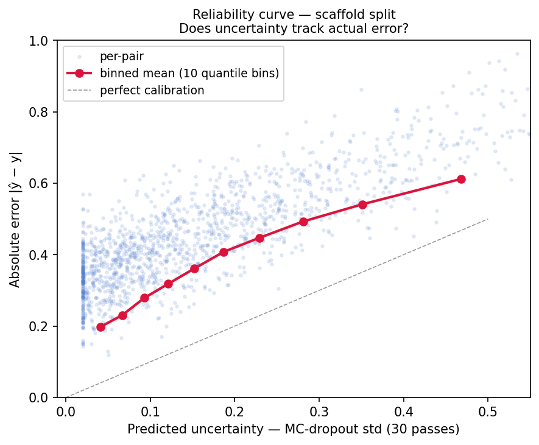

# DeepDTA Reproduction + Generalization Study

A clean PyTorch reproduction of [DeepDTA](https://arxiv.org/abs/1801.10193) (Öztürk et al., 2018) extended with a four-split generalization study and Monte Carlo dropout uncertainty calibration. The central finding: random-split MSE understates real-world error by up to **2×**, and model uncertainty is poorly calibrated on novel scaffolds—both critical considerations before deploying a DTI model in a drug-discovery campaign.

---

## Results — DAVIS Dataset (100 epochs)

| Split | MSE ↓ | CI ↑ | vs. random (MSE) |
|---|---|---|---|
| Random (paper setting) | **0.261** | **0.878** | baseline |
| Cold-drug | 0.395 | 0.820 | +51% |
| Scaffold | 0.458 | 0.791 | +76% |
| Cold-target | 0.531 | 0.763 | +104% |

> Random-split reproduces the published number (Öztürk et al. 2018, Table 2: MSE 0.261, CI 0.878), confirming the implementation is faithful.



### What the degradation means for drug discovery

**Random split (MSE 0.261)** is the number most DTI papers report. It is optimistic by design: because drug–target pairs are split at random, the train set contains many pairs with the same drug or the same target as pairs in the test set. The model is, in effect, interpolating between near-duplicates. This is not how a model gets used in a real campaign.

**Cold-drug split (MSE 0.395, +51%)** holds out entire drug entities. The test set contains molecules the model has never seen in any pairing. This is the relevant setting when a medicinal chemist synthesises a new compound and asks the model to predict its binding profile. The 51% MSE increase means predictions on genuinely novel molecules are meaningfully less reliable than the random-split number suggests.

**Scaffold split (MSE 0.458, +76%)** holds out entire Bemis-Murcko scaffold families. Every molecule in the test set has a core ring system that appeared in no training pair. This is the most honest measure of chemical generalization — the realistic analogue of "we are exploring a new chemotype, will the model guide us?" The 76% increase shows that scaffold-diverse prediction is substantially harder than predicting across randomly split pairs of the same scaffolds.

**Cold-target split (MSE 0.531, +104%)** holds out entire protein targets. The test set contains kinases or other proteins the model has never seen bound to any ligand. This doubles the MSE relative to random. For a project targeting a poorly characterised or novel protein — exactly the high-value, high-risk part of drug discovery — the model's predictions should be treated with considerable scepticism without experimental validation.

**Practical takeaway for a DMTA campaign:** for design decisions involving known scaffolds against characterised targets, DeepDTA-style predictions are reasonably reliable (random-split regime). As novelty increases — new chemotypes, new targets, or both — uncertainty grows substantially and the model should be used to prioritise experiments rather than replace them.

---

## Uncertainty calibration — scaffold split

Monte Carlo dropout (30 forward passes, dropout active at inference) was used to estimate predictive uncertainty on the scaffold test set.



The reliability curve shows binned mean uncertainty (MC-dropout std) against binned mean absolute error across 10 quantile bins. A perfectly calibrated model would follow the dashed diagonal. This model's uncertainty is **monotonically ordered** — higher predicted uncertainty does correlate with higher actual error — but the curve sits well above the diagonal, meaning the model is **overconfident**: it assigns lower uncertainty than the actual error warrants, especially in the low-uncertainty bins.

**For a medicinal chemist**, this means: when the model reports high confidence on a novel scaffold, it is still wrong more often than the confidence score implies. The uncertainty estimate is useful as a relative ranking (pairs with higher std are genuinely harder) but should not be read as a calibrated probability. Any deployment should include a calibration step (Platt scaling or isotonic regression) on a held-out scaffold set before uncertainty estimates drive go/no-go decisions.

---

## Architecture

Two parallel 1D-CNN towers encode the drug (SMILES) and protein (amino acid sequence) independently, then their representations are concatenated and passed through a three-layer fully-connected head to predict binding affinity as a scalar (pKd).

```
SMILES  → Embedding(64, 128) → Conv1d(128→32→64→96) → GlobalMaxPool → drug_vec  (96-d)
Protein → Embedding(25, 128) → Conv1d(128→32→64→96) → GlobalMaxPool → prot_vec  (96-d)
                                                                             ↓
                                                          concat → FC(192→1024→1024→512→1)
```

Key design choices:
- **No padding on convolutions** (paper uses 'valid'): the sequence dimension shrinks by `kernel_size − 1` at each layer, so deeper layers cover wider sequence contexts without artefacts.
- **Global max pool**: picks the strongest activation of each feature detector anywhere in the sequence, making the encoder output length-invariant and capturing "does this motif appear at all" — appropriate for binding, which depends on the presence of functional groups, not their position.
- **Drug kernel 4, protein kernel 8**: proteins are longer and more compositionally regular, so a wider receptive field is needed to capture meaningful secondary-structure-length motifs.

---

## Split strategies

### Random split
The paper's setting. Pairs are assigned to train/test at random. Optimistic because near-duplicate drugs or targets appear on both sides. Used here only as the reproduction validation gate.

### Cold-drug and cold-target splits
Entire drug or protein entities are held out. No pair containing a test drug (or target) appears in training. This is the minimum realistic evaluation for deployment on novel molecules or targets.

### Scaffold split (Bemis-Murcko)
Molecules are grouped by their Murcko scaffold (core ring system, computed via RDKit). Entire scaffold families are held out: no molecule in the test set shares a scaffold with any training molecule. This closes the "near-duplicate leakage" that cold-drug splits still allow (two different molecules can share a scaffold even if they are distinct entities). Scaffold splitting is the strongest available generalization test for the drug side and is the standard in recent TDC benchmarks.

---

## Reproducing the results

```bash
pip install -r requirements.txt

# Validate reproduction (should match paper: MSE ≈ 0.261, CI ≈ 0.878)
python -m src.main --dataset DAVIS --split random --epochs 100

# Full generalization study
python -m src.main --dataset DAVIS --all --epochs 100
```

---

## Honest caveats

- **DAVIS is a kinase-dominated dataset.** Many targets share high sequence identity, so "cold-target" is not perfectly cold — there is structural leakage across the split. The reported cold-target gap is therefore a *lower bound* on degradation against genuinely novel target families (e.g. GPCRs, ion channels).
- **Concordance index is O(n²).** Fine for DAVIS test sets (~1 500 pairs) but will be slow on KIBA (~12 000). Subsample the test set or switch to a vectorised CI implementation for KIBA.
- **MC-dropout approximates Bayesian uncertainty.** It captures parameter uncertainty conditional on architecture and training procedure, not model misspecification. Calibration on a dedicated held-out scaffold set is recommended before using std estimates for decision-making.

---

## Reference

Öztürk, H., Özgür, A., & Ozkirimli, E. (2018). DeepDTA: deep drug–target binding affinity prediction. *Bioinformatics*, 34(17), i821–i829. [https://doi.org/10.1093/bioinformatics/bty593](https://doi.org/10.1093/bioinformatics/bty593)

Huang, K., et al. (2021). Therapeutics Data Commons: Machine Learning Datasets and Tasks for Drug Discovery and Development. *NeurIPS 2021 Datasets and Benchmarks Track*. [https://tdcommons.ai](https://tdcommons.ai)
